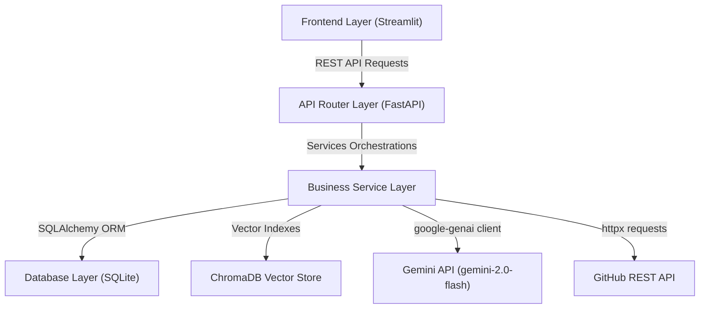

# 🤖 AI Interview Preparation Assistant (PREPAI)

[](https://www.python.org/)
[](https://fastapi.tiangolo.com/)
[](https://streamlit.io/)
[](https://aistudio.google.com/)
[](https://opensource.org/licenses/MIT)

PREPAI is a full-stack, AI-powered mock interview simulator and career mentor. Designed for college students, freshers, and software aspirants, it parses resumes, generates tailored interview questions matching job details, grades user answers constructively on 5 criteria, generates visual analytics dashboards, and designs personalized career roadmaps.

---

## ✨ Features

* **🔑 JWT User Authentication:** Secure sign-up/login, JWT tokens, bcrypt password hashing, and user profile management.
* **📄 Resume Analyzer:** Extract skills, project scope, experience, and educational details from uploaded PDF resumes. Flag skill gaps and suggest resume edits.
* **🎯 Mock Simulator:** Select interview type (Technical, HR, Behavioral, Project-Based) and difficulty (Easy, Medium, Hard). Simulates interactive session timer and progress tracking.
* **🧠 AI Answer Evaluation:** Gemini AI scores candidate answers out of 10. Assesses technical accuracy, communication quality, depth of understanding, clarity, and industry relevance, returning missed concepts and ideal model answers.
* **📊 Analytics Dashboard:** Interactive Plotly charts displaying overall score trends, weekly progress, topic performance, and skill growth over time.
* **🏢 Company Mode:** Generate customized questions matching unique hiring patterns of Google, Amazon, Microsoft, TCS, Infosys, and Accenture.
* **🐙 GitHub Portfolio Analyzer:** Review public repository metadata, language distribution, and generate project specific mock interview questions.
* **🗺️ Career Roadmap Generator:** Outline visual pathways detailing learning milestones, courses, suggested certifications, and showcase projects based on resume and mock metrics.

---

## 🏗️ Layered Architecture



---

## 📁 Project Structure

```
ai-interview-preparation-assistant/
├── frontend/
│   ├── app.py
│   ├── views/
│   │   ├── landing.py
│   │   ├── login.py
│   │   ├── register.py
│   │   ├── dashboard.py
│   │   ├── resume_analyzer.py
│   │   ├── interview_session.py
│   │   ├── interview_feedback.py
│   │   ├── analytics.py
│   │   ├── interview_history.py
│   │   ├── career_roadmap.py
│   │   ├── github_analyzer.py
│   │   └── company_interview.py
│   ├── components/
│   │   ├── sidebar.py
│   │   ├── charts.py
│   │   ├── cards.py
│   │   └── forms.py
│   ├── styles/
│   │   └── theme.css
│   ├── utils/
│   │   ├── api_client.py
│   │   └── session.py
│   └── assets/
│
├── backend/
│   ├── app/
│   │   ├── api/
│   │   ├── services/
│   │   ├── models/
│   │   ├── schemas/
│   │   ├── database/
│   │   ├── middleware/
│   │   │   └── auth_middleware.py
│   │   ├── utils/
│   │   │   ├── pdf_parser.py
│   │   │   └── chroma_client.py
│   │   └── core/
│   │       ├── config.py
│   │       └── security.py
│   ├── main.py
│   └── requirements.txt
│
├── tests/
│   ├── conftest.py
│   ├── test_auth.py
│   ├── test_resume.py
│   ├── test_interview.py
│   └── test_analytics.py
│
├── docs/
│   ├── API.md
│   └── SETUP.md
│
├── .env.example
├── .gitignore
└── requirements.txt
```

---

## 🚀 Setup and Run

### 1. Set Up Virtual Environment:
```bash
# Mac/Linux
python3 -m venv venv
source venv/bin/activate

# Windows
python -m venv venv
venv\Scripts\activate
```

### 2. Install Dependencies:
```bash
pip install -r requirements.txt
```

### 3. Setup Configuration:
Create `.env` based on `.env.example` and add your **`GEMINI_API_KEY`** from Google AI Studio.

### 4. Run Backend:
```bash
cd backend
python main.py
```

### 5. Run Frontend:
```bash
cd frontend
streamlit run app.py
```

---

## 📡 API Endpoints

| Category | Method | Endpoint | Description | Auth Required |
|----------|--------|----------|-------------|---------------|
| Auth | `POST` | `/api/auth/register` | Register new user profile | No |
| Auth | `POST` | `/api/auth/login` | Authenticate email & issue token | No |
| Auth | `GET` | `/api/auth/profile` | Retrieve user profile details | Yes |
| Resume | `POST` | `/api/resume/upload-resume` | Upload & analyze PDF resume | Yes |
| Interview | `POST` | `/api/interview/generate-questions` | Generate mock questions | Yes |
| Interview | `POST` | `/api/interview/submit-answer` | Submit response for AI grading | Yes |
| Analytics | `GET` | `/api/analytics/dashboard` | Retrieve dashboard aggregates | Yes |
| Career | `POST` | `/api/career/generate-roadmap` | Generate custom roadmap path | Yes |
| GitHub | `POST` | `/api/github/analyze-github` | Analyze repos & compile Q&A | Yes |

---

## 🔮 Future Enhancements

* **🎙️ Voice Mock Interview Mode:** Integrate Speech-to-Text for a real mock environment.
* **🎥 Video Behavior Insights:** Analyze candidate posture, eye contact, and facial expressions using webcam streams.
* **📚 Adaptive Question Engine:** Adjust question difficulty dynamically based on the score of previous answers.
* **📊 Peer Leaderboards:** Provide comparisons of performance metrics against other candidates preparing for similar roles.
* **💼 Real-time Job Matching:** Match resume and mock score profiles against open vacancies on LinkedIn or indeed.

---

## 📄 License
Distributed under the MIT License. See `LICENSE` for details.
